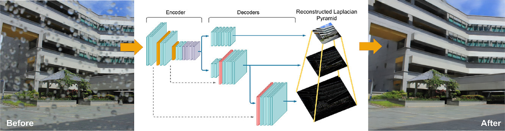

# Laplacian encoder-decoder network for raindrop removal



Official implementation of the paper ["Laplacian encoder-decoder network for raindrop removal".](https://www.sciencedirect.com/science/article/pii/S0167865522001143)

Written in Python 3.8.10 and Pytorch v1.9.1

## Getting Started

### Requirements

Requirements are stored in the requirements.txt file.

```
- matplotlib==3.3.3
- numpy==1.19.4
- opencv-python==4.4.0.46
- Pillow==8.0.1
- scikit-image==0.18.0
- scipy==1.5.4
- torch==1.9.1
- torchvision==0.10.1
```

Installation using python3-pip
```
pip3 install -r requirements.txt
```

## Training

### Running the reaining

To train the model, run the `main.py` inside the source directory, passing the training options.

E.g.
```bash
savedir='./trained_models/LAPNN_exp1'
images_dir='./dataset/'

python3 ./source/main.py  \
--threads 8 \
--batch_size 16 \
--lr 2e-5 \
--save_dir $savedir \
--images_dir $images_dir \
--augm \
--device cuda:0

```

To see the available options run:
```bash
python3 ./source/main.py  --h
```

### Training dataset configurarion

The dataloader expects a dataset structure as
```
Dataset
├── train
|   ├── data
|   |   ├──img01.png
|   |   ...
|   |   └──img#N.png
|   └── gt
|       ├──img01.png
|       ...
|       └──img#N.png
└── validation
    ├── data
    |   ├──img01.png
    |   ...
    |   └──img#N.png
    └── gt
        ├──img01.png
        ...
        └──img#N.png
```
where the `data` folder contains the images to be processed and the `gt` folder contains the target for loss evaluation.

## Inference

### Testset configuration

Pretrained model weights and optimizer weight are stored in the `./weights/` folder.

To evaluate a trained model use the `test.py` script, which loads a set of images and performs inference and  evaluation with PSNR and SSIM indexes.
Please note that this mode expects to have a dataset with input and ground truth.

E.g.
```bash
model='./weights/netLAP_v4_1_BASELINE.pth'

python3 ./source/test.py \
--input_dir ./test/data/ \
--gt_dir ./test/gt/ \
--output_dir ./tests/LAPNN_v4_1/ \
--model $model \
--device cuda:0
```

### Running the code
To run the code in inference, use `enhance_dir.py` script to run it on a directory containing multiple images.

E.g.
```bash
model='./weights/netLAP_v4_1_BASELINE.pth'

python3 ./source/enhance_dir.py \
--input_dir ./data/ \
--output_dir ./out/ \
--model $model \
--device cuda:0
```

## Cite

Please, if you use the code provided in this repository, cite our original work:

```
@article{zini2022laplacian,
  title={Laplacian encoder-decoder network for raindrop removal},
  author={Zini, Simone and Buzzelli, Marco},
  journal={Pattern Recognition Letters},
  volume={158},
  pages={24--33},
  year={2022},
  publisher={Elsevier}
}
```


    

